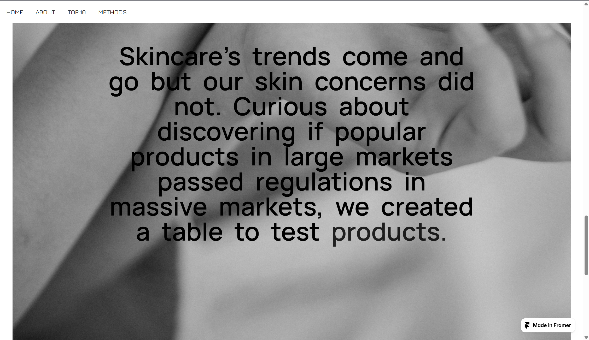

# Comparing and Analyzing Cosmetic Ingredient Regulations Across Countries

 
[Click here to access the website link!](https://pifu.framer.website/)

## Authors
- Angel Zeng 
- Ashley Maurad
- Jessica Wong

**Course:** DIDA 425: Spring 2026 - Binghamton University

**Instructor:** Jacopo Mazzoni  

## Project Overview
This project involves comparative data analysis of cosmetic ingredient regulations in California (USA), Taiwan, and the European  Union (EU). By examining popular skincare products sold through major retailers like Sephora, Ulta, and YesStyle, the project aims to identify cross-market regulatory inconsistencies. 

To make this information accessible to everyday consumers, an interactive website was developed to allow users to explore ingredient safety, compare products, and understand global cosmetic regulations through searchable datasets.

### Mission & Vision
**Mission:** To educate and equip consumers to make healthy, sustainable skincare choices by exposing cosmetic regulatory gaps and misleading marketing claims across the globe in an informative, interactive format.

**Vision:** Replace confusion with clarity. We aim to empower consumers to move beyond trend-driven and misinformed purchases into intentional, evidence-backed decisions.

----

## Background & Problem Statement
The rapid expansion of the global cosmetic industry, fueled by online shopping and social media trends, has created a highly saturated market. Consumers increasingly purchase skincare products globally without realizing that these products are subject to vastly different regulatory systems. To give an overview of the current cosmetic regulations upheld by the three countries: 
- **United States:** Historically lacks strict federal oversight and safety is mostly regulated by manufacturers. California, however, maintains the strictest state-level regulations.
- **Taiwan:** An emerging skincare leader and a key Asian hub for cosmetic manufacturing through advanced OEM/ODM services, meeting strict compliance to international quality control standards.
- **European Union:** A global leader in cosmetic safety, known for its strict, precautionary regulations banning over 1,600 substances.

## Methodology
### 1. Data Collection
- **Regulatory Data:** Gathered banned cosmetic ingredient lists from the EU (Annex II & III), Taiwan, and California.
- **Product Data:** Collected ingredient lists for top 10 selling skincare products from Sephora, Ulta, and YesStyle in 2025. 
- **External References:** Scraped and pulled data from INCIDecoder, CosIng (EU Cosmetic Database), U.S. EPA TSCA Database, PubChem, and manual sources to standardize ingredient names and identifier numbers (CAS). Source link can be found in the methods section of our [website](https://pifu.framer.website/methods).   

### 2. Data Cleaning & Standardization
- Cleaned datasets by standardizing formats, renaming columns, and removing duplicates.
- Adopted **CAS Registry Numbers (CAS RN®)** as the universal chemical identifier to match ingredients across different databases and naming conventions.

### 3. Master Database Construction
- Gathered the scraped INCIDecoder data as a baseline.
- Merged with CosIng and EPA records to fill missing identifiers.
- Used the PubChem API to resolve synonyms and unmatched ingredients.
- Created a "golden record" for each CAS number, keeping alternate names in another database.

### [3.5 The Purpose of Each Folder (Standard Data Pipeline Structure)] 
- data_raw: The raw files from database sources (governement public data, INCIDecoder, manual override websites and sources).
- data_middle: Refined CSV files that has been cleaned and merged with all the raw databases.
- data_match_reference: The final cleaned versions of the databases (standardized language - CAS Number).
    - overarching database: Banned ingredients across the EU, Taiwan, US (California).
    - master gold database: Comprehensive list of cosmetic ingredients found from all sources (INCIDecoder, PubChem, SpecialChem, CosIng EU, EPA, NIH) with their matched CAS number.
    - aliases gold database: A list of all the alternative names for the ingredients in the master database.
- data_clean: Contains the final analysis CSV files that can be used for comparison & drawing conclusions, includes basic data visualizations and other images.

### 4. Comparative Analysis
- Cross-checked product ingredient lists against the overarching regulatory database of banned ingredients using matched CAS numbers.
- Determined if products sold by mainstream retailers contained ingredients banned in California, Taiwan, or the EU.
- Develoepd basic data visualization tables depicting the regulatory differences and overlaps between the three regions. 

### 5. Website Development
- Built using **Framer CMS** integrated with **Google Sheets**.
- Features include search functionality, toggle-based filtering, interactive comparison tables, and visual insights into regulatory disparities between countries.

----

## Tech Stack & Tools
- **Languages:** Python
- **Environments:** Google Colab, Visual Studio Code
- **Web Development:** Framer CMS
- **Data Storage:** Google Sheets, CSV
- **APIs & Databases:** PubChem API, INCIDecoder, CosIng, EPA TSCA

----

## Key Findings & Results
- **Regulatory Disparity:** The EU bans roughly 2,200 ingredients, Taiwan bans 657, and California bans 64. There is a substantial gap in global cosmetic safety standards.
- **Product Compliance:** Within the scope of identifiable ingredients (~68% match rate), most top-selling products analyzed did not contain banned ingredients.
- **Flagged Product Case Study:** *Ulta's La Roche-Posay Toleriane Double Repair* was flagged for containing three ingredients restricted elsewhere:
  - **Acrylonitrile:** Banned in Taiwan and the EU.
  - **Isobutane:** Banned in the EU.
  - **Methyl Methacrylate:** Banned in Taiwan.
  - *None of these are banned in California.*

## Discussion
Our research points to one major takeaway: cosmetic safety standards imbalanced and are far from equal worldwide. The European Union leads with strict and rigorous regulations, Taiwan being a close second, and with California trailing behind. Although the majority of analyzed and products complied with regional standards in our matched datasets, we found a mainstream product and brand that underscores the lack of universal cosmetic safety protocols. In an era where viral social media trends and online shopping blur the line between factual information and marketing catchphrases, consumers shoult not assume that a prodcut sold and promoted through influencers are going to be THE product for them. 

This project goes beyond pointing out the problem. We hope to offer a beginning to a solution. By combining complex global regulations into one searchable database, we hope to make ingredient research accessible and transparent to the general public. Ultimately, a foundational understanding of these regulatory disrepancies can have a profound impact. As public knowledge expands and becomes transparent, we can create the necessary momentum to drive actionable reform in cosmetic policy. 

The more we understand the reality of global cosmetic safety, the better equipped we are to advocate for stronger, safer policies. This advocacy can occur domestically, by benchmarking against stricter international standards, or internationally fostering harmonized regulatory frameworks. Moving forward, protecting consumers will require collaboartion across global regulatory agencies, clearer ingredient labels, and accessible public tools that bring clarity to the booming skincare market.

----

## Limitations
- **Data Matching:** Approximately 32% of ingredients could not be confidently matched to a standardized CAS number due to missing data, messy naming conventions, and incomplete databases.
- **Scope:** Using California as a proxy for the U.S. does not capture state-to-state variations or future federal updates.

## Future Work
- Improve database coverage, common chemistry integration, and synonym resolution to achieve higher match rates (more aggressively addressing the 32%).
- Expand datasets to evaluate a broader range of substances and cosmetic product categories.

## Published Datasets
*Usaage: Public, can be used/referenced/improved on by anyone!*
- [Overarching Regulatory Table](data_match_reference/Overarching_Regulatory_Table.csv)
- [Final Product Ingredient Analysis](data_clean/Final_Product_Ingredient_Analysis.csv) 
- [Regulatory Overlap Summary](data_clean/Regulatory_Overlap_Summary.csv)

## Contact Information 
If you have any questions or you would like to expand on this conversation, feel free to reach out! 
- Angel Zeng (azeng7@binghamton.edu)
- Ashley Maurad (ashleymaurad57@gmail.com)
- Jessica Wong (wjesseny@gmail.com)